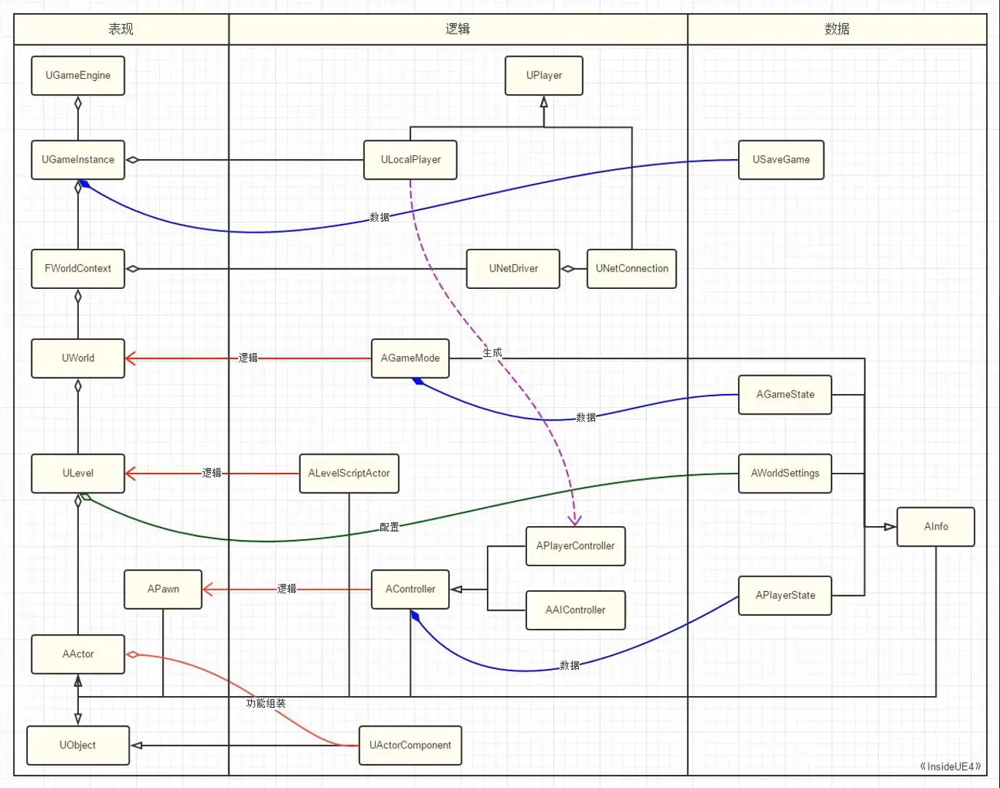

# UE4 源码阅读笔记

记录 UE4 源码阅读及学习笔记

## UE4 术语解释

- Level： 用户定义的一个游戏区域(上面可以摆放植被、树木、地形、野怪等)，并且可以在Level-Blueprint里定义该Level的逻辑处理 。 每个Level在编辑器里制作后保存为umap后缀的文件，所以也被称为Map。
- World： World就是表示当前的游戏世界, 同时可以包含多个Levels，这些Levels拼凑成一个巨大的游戏场景。World可以动态加载这些 Levels(根据玩家在世界的何处)，这个技术称为Streaming Level。通过World提供的Spwan()接口，我们可以在游戏进行时动态地添加Actors。
- Actor： Actor是放在Level中的基本的实体，它可以动态地被创建到World中。
- Component： Component是一个功能对象体, 它隶属于Actor, 通过给Actor添加不同的Component来赋予它不同的功能特性。
    - StaticMesh-Component就会让Actor能够在场景画面上有视觉表现。
    - Audio-Component让Actor能够发出声音功能。
    - RotatingMovement-Component可以让Actor在世界中移动旋转。
 
- Pawn： Pawn是一个特殊的Actor,表示游戏世界中的生命体, 它可以被Controller控制,并且可以被设置成可接受用户的Input, 它不局限于表示人类。
- Character： Character是一个类人的Pawn. 它带有用于碰撞的胶囊体(CapsuleComponent)和人物运动组件(CharacterMovementComponent),它做基本的类人运动。
- HUD： A HUD is a "heads-up display",用于在屏幕上显示二维的UI信息(如血条、玩家名称等). NOTE: 每个PlayerController只有一个AHUD类对象.
- Camera： PlayerCameraManager相当于人的眼睛. NOTE: 每个PlayerController只有一个PlayerCameraManager. Camera工作流程，通过阅读链接中的工作流程可知, 绘制场景时使用的SceneView参数是由PlayerCameraManager决定的，其它的Camera, CameraActor, ViewTarget是用于辅助的。
- GameMode： 定义了游戏的规则. 不用的游戏有不同的GameMode，可以在Project Setting里配置。
- GameState： GameState包含了游戏的状态,如:当前游戏中的玩家列表、得分情况、玩家的任务清单完成情况等。
- PlayerState： 玩家的状态,如:名字、得分、等级等。
- UMG： Unreal Motion Graphics UI Designer (UMG)。虚幻动态图形 UI 设计器 (UMG) 是一款视觉 UI 创作工具，可用于创作想要呈现给用户的 UI 元素，比如游戏内的 HUD、菜单或与界面相关的其他图形。UMG 的核心是控件，即用于构成界面的一系列预先制作的功能（比如按钮、复选框、滑块、进度条等）。

### 一些补充

word、level、actor 之间的关系：

- World（当前游戏世界，可以包含多个level）
    - Level（GameMoDe）（关，也称为Map）
        - Actor（实体，可以被动态添加）
            - Component（隶属于Actor的功能对象体，如staticMeshComponent）
        - Pawn（特殊的Actor，表示游戏世界中的生命体）
        - Character（一个类人的Pawn，带胶囊体和人体运动组件）

UMG对象关系如下图:


## UE4 数据类型

### 数字类型

因为不同平台基础类型的尺寸不同，如 short、int 和 long，UE4 提供了以下类型，可用作替代品：

- int8/uint8 ：8 位带符号/不带符号 整数

- int16/uint16 ：16 位带符号/不带符号 整数

- int32/uint32 ：32 位带符号/不带符号 整数

- int64/uint64 ：64 位带符号/不带符号整数

标准 浮点 （32-bit） 和 双倍（64-bit）类型也支持浮点数。

虚幻引擎拥有一个模板 TNumericLimits，用于找到数值类型支持的最小和最大范围。

### 字符串

UE4 提供多个不同类使用字符串，可满足多种需求。

**FString**

FString 是一个可变字符串，类似于 std::string。FString 拥有许多方法，便于简单地使用字符串。使用 TEXT() 宏可新建一个 FString：


```FString MyStr = TEXT("Hello, Unreal 4!").```

**FText**

FText 与 FString 相似，但用于本地化文本。使用 NSLOCTEXT 宏可新建一个 FText。此宏拥有默认语言的命名空间、键和一个数值。

```FText MyText = NSLOCTEXT("Game UI", "Health Warning Message", "Low Health!")```

也可使用 LOCTEXT 宏，只需要在每个文件上定义一次命名空间。确保在文件底层取消它的定义

```
// 在 GameUI.cpp 中
#define LOCTEXT_NAMESPACE "Game UI"

//...
FText MyText = LOCTEXT("Health Warning Message", "Low Health!")
//...

#undef LOCTEXT_NAMESPACE
// 文件末端
```

**FName**

FName 将经常反复出现的字符串保存为辨识符，以便在对比时节约内存和 CPU 时间。FName 不会在引用完整字符串的每个对象间对其进行多次保存，而是使用一个映射到给定字符串的较小存储空间 索引。这会单次保存字符串内容，在字符串用于多个对象之间时节约内存。检查 NameA.Index 是否等于 NameB.Index 可对两个字符串进行快速对比，避免对字符串中每个字符进行相等性检查。

**TCHAR**

TCHARs 用于存储不受正在使用的字符集约束的字符。平台不同，它们也可能存在不同。UE4 字符串在后台使用 TCHAR 阵列将数据保存在 UTF-16 编码中。使用返回 TCHAR 的重载解引用运算符可以访问原始数据。

部分函数会需要它。如 FString::Printf，‘%s’ 字符串格式说明符需要 TCHAR，而非 FString。

```
FString Str1 = TEXT("World");
int32 Val1 = 123;
FString Str2 = FString::Printf(TEXT("Hello, %s! You have %i points."), *Str1, Val1);
```

FChar 类型提供一个静态效用函数集，以便使用单个 TCHAR。

```
TCHAR Upper('A');
TCHAR Lower = FChar::ToLower(Upper); // 'a'
FChar 类型被定义为 TChar（因其列在 API 中）。
```

### 容器

容器也是类，它们的主要功能是存储数据集。常见的类有 TArray、TMap 和 TSet。它们的大小均为动态，因此可变为所需的任意大小。

**TArray**

在这三个容器中，虚幻引擎 4 使用的主要容器是 TArray。它的作用和 std::vector 相似，但却多出许多功能。以下是一些常规操作：

```
TArray<AActor*> ActorArray = GetActorArrayFromSomewhere();

// 告知当前 ActorArray 中保存的元素（AActors）数量。
int32 ArraySize = ActorArray.Num();

// TArrays 从零开始（第一个元素在索引 0 处）
int32 Index = 0;
// 尝试获取在给定索引处的元素
TArray* FirstActor = ActorArray[Index];

// 在阵列末端添加一个新元素
AActor* NewActor = GetNewActor();
ActorArray.Add(NewActor);

// 只有元素不在阵列中时，才在阵列末端添加元素
ActorArray.AddUnique(NewActor); // 不会改变阵列，因为 NewActor 已被添加

// 移除阵列中所有 NewActor 实例
ActorArray.Remove(NewActor);

// 移除特定索引处的元素
// 索引上的元素将被下调一格，以填充空出的位置
ActorArray.RemoveAt(Index);

// RemoveAt 的高效版，但无法保持元素的排序
ActorArray.RemoveAtSwap(Index);

// 移除阵列中的所有元素
ActorArray.Empty();
```

TArray 还有一个额外好处 - 可使其元素被垃圾回收。这将假定 TArray 被标记为 UPROPERTY，并存储 UObject 派生的指针。

```
UCLASS()
class UMyClass :UObject
{
    GENERATED_BODY();

    // ...

    UPROPERTY()
    TArray<AActor*> GarbageCollectedArray;
};
```

**TMap**

TMap 是键值对的合集，与 std::map 相似。TMap 可基于元素的键快速寻找、添加、并移除元素。只要键拥有为其定义的 GetTypeHash 函数（稍后对此进行了解），即可使用任意类型的键。

假设您创建了一个基于网格的桌面游戏，需要保存并询问每个方格上的块。通过 TMap 即可轻松完成。如棋盘尺寸较小且保持不变，还存在更加高效的处理方式。

```
enum class EPieceType
{
    King,
    Queen,
    Rook,
    Bishop,
    Knight,
    Pawn
};

struct FPiece
{
    int32 PlayerId;
    EPieceType Type;
    FIntPoint Position;

    FPiece(int32 InPlayerId, EPieceType InType, FIntVector InPosition) :
        PlayerId(InPlayerId),
        Type(InType),
        Position(InPosition)
    {
    }
};

class FBoard
{
private:

    // 使用 TMap 时可通过块的位置对其进行查阅
    TMap<FIntPoint, FPiece> Data;

public:
    bool HasPieceAtPosition(FIntPoint Position)
    {
        return Data.Contains(Position);
    }
    FPiece GetPieceAtPosition(FIntPoint Position)
    {
        return Data[Position];
    }

    void AddNewPiece(int32 PlayerId, EPieceType Type, FIntPoint Position)
    {
        FPiece NewPiece(PlayerId, Type, Position);
        Data.Add(Position, NewPiece);
    }

    void MovePiece(FIntPoint OldPosition, FIntPoint NewPosition)
    {
        FPiece Piece = Data[OldPosition];
        Piece.Position = NewPosition;
        Data.Remove(OldPosition);
        Data.Add(NewPosition, Piece);
    }

    void RemovePieceAtPosition(FIntPoint Position)
    {
        Data.Remove(Position);
    }

    void ClearBoard()
    {
        Data.Empty();
    }
};

```

**TSet**

TSet 保存唯一值的合集，与 std::set 相似。TArray 通过 AddUnique 和 Contains 方法可用作集。然而 TSet 可更快实现这些操作，但无法像 TArray 那样将它们用作 UPROPERTY。TSet 不会像 TArray 那样将元素编入索引。

```
TSet<AActor*> ActorSet = GetActorSetFromSomewhere();

int32 Size = ActorSet.Num();

// 如集尚未包含元素，则将其添加到集
AActor* NewActor = GetNewActor();
ActorSet.Add(NewActor);

// 检查元素是否已包含在集中
if (ActorSet.Contains(NewActor))
{
    // ...
}

// 从集移除元素
ActorSet.Remove(NewActor);

// 从集移除所有元素
ActorSet.Empty();

// 创建包含 TSet 元素的 TArray
TArray<AActor*> ActorArrayFromSet = ActorSet.Array();
```

需注意：TArray 是当前唯一能被标记为 UPROPERTY 的容器类。这意味着无法复制、保存其他容器类，或对其元素进行垃圾回收。

**容器迭代器**

使用迭代器可在容器的每个元素上进行循环。以下是使用 TSet 的迭代器语法范例。

```
void RemoveDeadEnemies(TSet<AEnemy*>& EnemySet)
{
    // 从集的开头开始迭代到集的末端
    for (auto EnemyIterator = EnemySet.CreateIterator(); EnemyIterator; ++EnemyIterator)
    {
        // * 运算符获得当前的元素
        AEnemy* Enemy = *EnemyIterator;
        if (Enemy.Health == 0)
        {
            // RemoveCurrent 由 TSets 和 TMaps 支持
            EnemyIterator.RemoveCurrent();
        }
    }
}
```

可结合迭代器使用的其他支持操作：

```
// 将迭代器移回一个元素
--EnemyIterator;

// 以一定偏移前移或后移迭代器，此处的偏移为一个整数
EnemyIterator += Offset;
EnemyIterator -= Offset;

// 获得当前元素的索引
int32 Index = EnemyIterator.GetIndex();

// 将迭代器重设为第一个元素
EnemyIterator.Reset();
```

**For-each 循环**

迭代器很实用，但如果只希望在每个元素之间循环一次，则可能会有些累赘。每个容器类还支持 for each 风格的语法在元素上进行循环。TArray 和 TSet 返回每个元素，而 TMap 返回一个键值对。

```
// TArray
TArray<AActor*> ActorArray = GetArrayFromSomewhere();
for (AActor* OneActor :ActorArray)
{
    // ...
}

// TSet - 和 TArray 相同
TSet<AActor*> ActorSet = GetSetFromSomewhere();
for (AActor* UniqueActor :ActorSet)
{
    // ...
}

// TMap - 迭代器返回一个键值对
TMap<FName, AActor*> NameToActorMap = GetMapFromSomewhere();
for (auto& KVP :NameToActorMap)
{
    FName Name = KVP.Key;
    AActor* Actor = KVP.Value;

    // ...
}
```

注意：auto 关键词不会自动指定指针/引用，需要自行添加。

**通过 TSet/TMap（散列函数）使用您自己的类型**


TSet 和 TMap 需要在内部使用 散列函数。如要创建在 TSet 中使用或作为 TMap 键使用的自定义类，首先需要创建自定义散列函数。通常会放入这些类型的多数 UE4 类型已定义其自身的散列函数。

散列函数接受到您的类型的常量指针/引用，并返回一个 uint64。此返回值即为对象的 散列代码，应该是对该对象唯一虚拟的数值。两个相等的对象固定返回相同的散列代码。

```
class FMyClass
{
    uint32 ExampleProperty1;
    uint32 ExampleProperty2;

    // 散列函数
    friend uint32 GetTypeHash(const FMyClass& MyClass)
    {
        // HashCombine 是将两个散列值组合起来的效用函数
        uint32 HashCode = HashCombine(MyClass.ExampleProperty1, MyClass.ExampleProperty2);
        return HashCode;
    }

    // 出于展示目的，两个对象为相等
    // 应固定返回相同的散列代码。
    bool operator==(const FMyClass& LHS, const FMyClass& RHS)
    {
        return LHS.ExampleProperty1 == RHS.ExampleProperty1
            && LHS.ExampleProperty2 == RHS.ExampleProperty2;
    }
};
```

现在， TSet 和 TMap 在散列键时将使用适当的散列函数。如您使用指针作为键（即 TSet<FMyClass*>），也将实现 uint32 GetTypeHash(const FMyClass* MyClass)。


## UE4 类型系统

在编译之前，通过UHT扫描头文件中特定的宏来生成相关代码（*.generated.h / *.gen.cpp），然后再一起编译链接进游戏，来生成类型系统、扩展语言修饰符和收集元数据UMetaData


类型系统在对象之外，提供了一个静态信息载体，不仅描述了对象自身，还能构建起来对象之间的派生从属关系

通过查询类型系统数据，可实现强大的运行时类型识别（RTTI，Run-Time Type Identification）。例如：根据类型创建对象，遍历和修改属性成员，根据名字来调用函数。

默认对象（Class Default Object，简称CDO）、反射（Reflection）、垃圾回收（Garbage Collection，简称GC）、序列化（Serialization）都是在类型系统的基础上实现的

 

通过修饰符来在编程语言层面扩展c++能力，引擎底层提供对修饰符实现，与引擎深度结合，程序员可通过配置修饰符让对象、属性或函数拥有更强大的能力

修饰符可优雅地实现c++与蓝图的互操作、编辑器支持、网络同步等方面的功能

例如：Config修饰符来从指定ini文件中读取数据、Transient修饰符来指明不需要序列化、Exec修饰符来指明该函数可被控制台调用

Replicated修饰符给属性加上同步属性、Server修饰符表明该函数为一个对服务端的RPC调用，等等

 

元数据UMetaData其实就是个键值对的集合，用于为编辑器提供分类、友好名字、提示等信息，Android、IOS、DS版本不包含此信息（相关逻辑包裹在宏WITH_EDITORONLY_DATA中）


## UE4 中的类

### 1. 常见的类

在UE4中，有很多类用于创建游戏世界、处理输入、管理角色等。以下是其中一些常见的类：

- Actor: Actor是UE4中的基础类，可以放置在场景中。它可以有组件，并且可以响应输入和状态变化。
- Pawn: Pawn继承自Actor，通常用于表示玩家或AI控制的角色。它可以接受控制输入并具有基本的移动和交互能力。
- Character: Character是一种特殊的Pawn，具有行走、跑动和跳跃等行为。它通常用于表示玩家角色，具有行走、跑动和跳跃等能力。
- Controller: Controller是一个没有物理表现的Actor，用于控制Pawn或Character。它可以接收输入并传递给其控制的Pawn或Character。
- PlayerController: PlayerController是专门用于控制玩家角色的Controller。它处理玩家的输入并传递给玩家角色。
- AIController: AIController用于控制AI角色。它可以接收来自AI系统的输入并指导其控制的Pawn或Character的行为。
- Component: Component是一种特殊类型的对象，不能单独存在，必须作为其他对象的子对象。它用于扩展Actor的功能，例如添加物理效果、图形或声音等。
- ActorComponent: ActorComponent是Component的基类，它是所有Actor特有的组件的基类。它提供了基本的创建、销毁、复制网络和触发事件等逻辑性的功能。
- SceneComponent: SceneComponent是ActorComponent的子类，可以嵌套其他组件。它主要用于场景管理和物理表现。
- BlockchainComponent: BlockchainComponent用于在游戏世界中管理区块链数据和事务。它可以提供去中心化游戏功能，例如代币交易和智能合约。
- InputComponent: InputComponent用于处理玩家输入，例如键盘和鼠标操作。它可以响应玩家的输入并传递给Actor或Pawn。
- NavMeshComponent: NavMeshComponent用于创建导航网格，用于AI角色的路径规划和移动。它可以检测角色的可移动区域和障碍物。
- AnimationBlueprint: AnimationBlueprint是一种特殊的蓝图，用于创建角色的动画序列。它可以通过编辑器或代码来定义动画和状态转换，并应用于Character或Actor上。
- AI Blueprint: AI Blueprint是一种特殊的蓝图，用于定义AI角色的行为和决策。它可以创建行为树和决策系统，使AI角色能够根据环境和其他因素做出智能的行为选择。
- GameplayStatics: GameplayStatics提供了一些静态函数和变量，用于处理游戏逻辑和状态管理。它提供了一些常用的功能，例如获取场景中所有Actor的计数或获取玩家的分数等。

以上只是UE4中常见的类的一部分，实际上还有很多其他类和功能可供开发者使用。对于具体的开发需求，建议参考UE4的官方文档和示例项目来了解更多类和功能的用法。

### 2. 类名的首字母含义

- A 开头： 从可生成的 游戏性对象的基础类进行延伸。它们是 Actor，可直接生成到世界场景中。
- E 开头：列举的前缀为E， 如 EFortificationType。
- F 开头： F=Function=功能，如FString，FVector，FName,FMaterialParticleParameters。 另一种说法：“F”前缀实际上代表的“Float”。Tim Sweeney最先编写了原始的“FVector”类以及许多原始的数学类，“F”前缀有助于区分支持整数或双精度的数学构造。许多引擎代码都处理浮点值，因此该模式在当时迅速传播到其他新的引擎类中，然后最终成为所有地方的标准。
- I 开头：抽象界面类的前缀为I，如 IAbilitySystemInterface。 
- S 开头：继承自 SWidget(Slate UI) 的类前缀为S，如 SButton。
- U 开头： U=UObject=类/对象，如 UComponent。 从所有游戏性对象的基础类进行延伸。它们无法被实例到世界场景中，必须从属于 Actor。总体而言，它们是与 组件 相似的对象。
- T 开头：模板类， 如 TArray。

### 3. 类的关系

类的UML图:



## 参考

- https://brotherswei.github.io/index.html
