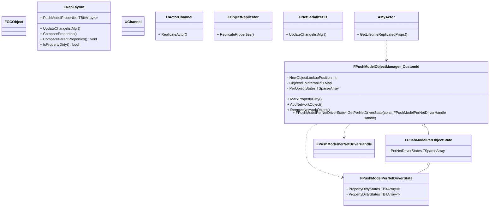

# UE4 网络同步-PushModel

#PushModel


## 核心类简介

**FObjectReplicator**

对于需要做网络同步的Actor/Subobject，ActorChannel会为其创建ObjectReplicator，统筹实现并管理其网络同步状态和逻辑，具体如下：

- DS端: 主要用于处理属性网络同步、属性同步重传以及RPC同步
- 客户端: 主要用于接收处理RepNotify回调以及RPC同步

**FRepLayout**

为需要同步的类型保存其属性同步的结构，并负责属性同步的序列化(读写)以及属性状态对比等

这里的类型有三种：

- UClass：UObject的属性同步，FRepLayout::InitFromClass中初始化
- UStruct：目前只应用于FastArray的同步和序列化，FRepLayout::InitFromStruct中初始化
- UFunction：RPC的属性同步，FRepLayout::InitFromFunction中初始化

由于RepLayout是针对某个类型而言，因此RepLayout和Type是一 一对应的，换言之，同一类型的对象共享一个RepLayout

此外RepLayout内部维护了两个数据结构的数组：

```
/** Top level Layout Commands. */
TArray<FRepParentCmd> Parents;

/** All Layout Commands. */
TArray<FRepLayoutCmd> Cmds;
```

**FRepParentCmd**

同步属性的顶层结构Cmd

- Property：属性指针

- ArrayIndex：如果是C-Style的定长数组（对应FProperty的ArrayDim>0），UE会为该数组的每个元素都创建一个FRepParentCmd，ArrayIndex就表示该元素在这个数组中的下标；否则为0

C-Style的定长数组一般很少用，大多数情况都是用TArray，因此ArrayIndex一般也都是0
Offset：属性在UObject内存中的偏移

- ShadowOffset：属性在ShadowData中的地址偏移

- CmdStart/CmdEnd：分别表示FRepParentCmd所关联的FRepLayoutCmd在Cmds数组中的下标起始范围[CmdStart，CmdEnd - 1]

- Condition：同步条件，就是GetLifetimeReplicatedProps函数中为属性用DOREPLIFETIME_CONDITION定义的同步条件

- RepNotifyCondition：RepNotify的条件

**FRepLayoutCmd**

同步属性的子层结构Cmd

- Property：属性指针

- EndCmd：数组类型属性的Return Cmd在Cmds数组中的下标，Return Cmd可以理解为结束标记

- ElementSize：属性元素内存大小

- Offset：属性在UObject内存中的偏移

- ShadowOffset：属性在ShadowData中的地址偏移

- RelativeHandle：RelativeHandle - 1就是当前Cmd在Cmds数组中的下标

- ParentIndex：所属的Parent Cmd在Parents数组中的下标

- Type：Cmd的类型

- Flags：标记

**FRepState**

**FSendingRepState**

记录属性同步发送端的状态，更最重要的作用是处理属性同步的重传逻辑

由于属性只能从DS同步到客户端，因此FSendingRepState只会在DS端创建
ChangeHistory：是一个类型为FRepChangedHistory、长度为32的Circular buffer，存储发送端发送的属性历史状态，主要用于重传

这里有点类似TCP的滑动窗口，一方面用于同步，另一方面用于重传
HistoryStart：Circular buffer的起始下标

HistoryEnd：Circular buffer的结束下标

LastChangelistIndex：LastChangelistIndex-1为上一次同步的ChangeList在FRepChangelistState::ChangeHistory中的下标，如果LastChangelistIndex等于FRepChangelistState::HistoryEnd，表示没有需要同步的ChangeList

LastCompareIndex：上一次属性对比的Index，用于判断是否有属性发生变化

InactiveChangelist：ChangeList的active状态列表

InactiveParents：Parent Cmd的active状态列表

**FReceivingRepState**

属性同步接收端的状态

由于属性只能从DS同步到客户端，因此FReceivingRepState只会在客户端创建
StaticBuffer：存储属性的历史状态，主要用于判断属性是否变化，是否需要触发RepNotify回调

GuidReferencesMap：属性的NetGuid映射map

RepNotifies：有OnRep回调的属性列表

RepNotifyMetaData：RepNotifies的MetaData

**FReplicationChangelistMgr**

属性同步ChangeList的manager，内部维护了一个FRepChangelistState类型的对象RepChangelistState，存储最近的属性变化历史列表，用于判断属性是否发生变化

**FRepChangelistState**

ChangeHistory：长度为64、类型为FRepChangedHistory的Circular buffer，存储属性变化历史列表

这里需要注意不要和FSendingRepState中的ChangeHistory混淆，虽然都是FRepChangedHistory类型的Circular buffer，但二者作用是不一样的
HistoryStart：ChangeHistory中的起点，相当于最旧的ChangeList

HistoryEnd：ChangeHistory中的终点，相当于最新的ChangeList

CompareIndex：属性对比计数

StaticBuffer：存储当前对象所有属性的历史状态，用于比较属性时判断属性是否发生变化，引擎称之为ShadowData

SharedSerialization：共享的序列化数据

**FRepChangedHistory**

OutPacketIdRange：当前ChangeList最近一次发送的Packet ID范围，用于跟踪Ack

Changed：ChangeList列表

Resend：当前ChangeList是否需要重传

## 相关宏定义

```
#if WITH_PUSH_MODEL
```

Engine/Source/Runtime/Net/Core/Public/Net/Core/PushModel/PushModelMacros.h

```

#define DISABLE_PUSH_MODEL_VALIDATION 0
#define WITH_PUSH_VALIDATION_SUPPORT (WITH_PUSH_MODEL && !(UE_BUILD_SHIPPING || UE_BUILD_TEST || DISABLE_PUSH_MODEL_VALIDATION))

#define REPLICATED_BASE_CLASS(ClassName) \
private: \
int32 NetPushId_Internal = INDEX_NONE; \
virtual void SetNetPushIdDynamic(const int32 InNetPushId) override { NetPushId_Internal = InNetPushId; } \
virtual int32 GetNetPushIdDynamic() const override { return GetNetPushId(); } \
public: \
int32 GetNetPushId() const { return NetPushId_Internal; }

```


Engine/Source/Runtime/Net/Core/Public/Net/Core/PushModel/PushModel.h

```
// Marks a property dirty by RepIndex without doing additional rep index validation.
#define MARK_PROPERTY_DIRTY_UNSAFE(Object, RepIndex) CONDITIONAL_ON_OBJECT_NET_ID_DYNAMIC(Object, UE4PushModelPrivate::MarkPropertyDirty(PrivatePushId, RepIndex))

// Marks a property dirty by UProperty*, validating that it's actually a replicated property.
#define MARK_PROPERTY_DIRTY(Object, Property) CONDITIONAL_ON_REP_INDEX_AND_OBJECT_NET_ID(Object, Property, UE4PushModelPrivate::MarkPropertyDirty(PrivatePushId, Property->RepIndex))


// Marks a static array property dirty given, the Object, UProperty*, and Index.
#define MARK_PROPERTY_DIRTY_STATIC_ARRAY_INDEX(Object, Property, ArrayIndex) CONDITIONAL_ON_REP_INDEX_AND_OBJECT_NET_ID(Object, Property, UE4PushModelPrivate::MarkPropertyDirty(PrivatePushId, Property->RepIndex + ArrayIndex))

// Marks all elements of a static array property dirty, given the Object and UProperty*
#define MARK_PROPERTY_DIRTY_STATIC_ARRAY(Object, Property) CONDITIONAL_ON_REP_INDEX_AND_OBJECT_NET_ID(Object, Property, UE4PushModelPrivate::MarkPropertyDirty(PrivatePushId, Property->RepIndex, Property->RepIndex + Property->ArrayDim - 1))


// Marks a property dirty, given the Class Name, Property Name, and Object. This will fail to compile if the Property or Class aren't valid.
#define MARK_PROPERTY_DIRTY_FROM_NAME(ClassName, PropertyName, Object) CONDITIONAL_ON_OBJECT_NET_ID(Object, UE4PushModelPrivate::MarkPropertyDirty(PrivatePushId, GET_PROPERTY_REP_INDEX(ClassName, PropertyName)))

```

## 代码阅读

类图



## 参考

- [《UE4 Notes》网络同步相关（三）Actor网络同步](https://zhuanlan.zhihu.com/p/664380554)
- [UE4属性同步 —— 服务器同步属性（二](https://juejin.cn/post/7126863871280676871)


