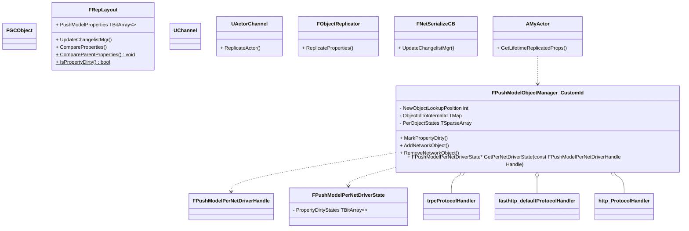

# UE4 网络同步-PushModel

#PushModel

## 相关宏定义

```
#if WITH_PUSH_MODEL
```

Engine/Source/Runtime/Net/Core/Public/Net/Core/PushModel/PushModelMacros.h

```

#define DISABLE_PUSH_MODEL_VALIDATION 0
#define WITH_PUSH_VALIDATION_SUPPORT (WITH_PUSH_MODEL && !(UE_BUILD_SHIPPING || UE_BUILD_TEST || DISABLE_PUSH_MODEL_VALIDATION))

#define REPLICATED_BASE_CLASS(ClassName) \
private: \
int32 NetPushId_Internal = INDEX_NONE; \
virtual void SetNetPushIdDynamic(const int32 InNetPushId) override { NetPushId_Internal = InNetPushId; } \
virtual int32 GetNetPushIdDynamic() const override { return GetNetPushId(); } \
public: \
int32 GetNetPushId() const { return NetPushId_Internal; }

```


Engine/Source/Runtime/Net/Core/Public/Net/Core/PushModel/PushModel.h

```
// Marks a property dirty by RepIndex without doing additional rep index validation.
#define MARK_PROPERTY_DIRTY_UNSAFE(Object, RepIndex) CONDITIONAL_ON_OBJECT_NET_ID_DYNAMIC(Object, UE4PushModelPrivate::MarkPropertyDirty(PrivatePushId, RepIndex))

// Marks a property dirty by UProperty*, validating that it's actually a replicated property.
#define MARK_PROPERTY_DIRTY(Object, Property) CONDITIONAL_ON_REP_INDEX_AND_OBJECT_NET_ID(Object, Property, UE4PushModelPrivate::MarkPropertyDirty(PrivatePushId, Property->RepIndex))


// Marks a static array property dirty given, the Object, UProperty*, and Index.
#define MARK_PROPERTY_DIRTY_STATIC_ARRAY_INDEX(Object, Property, ArrayIndex) CONDITIONAL_ON_REP_INDEX_AND_OBJECT_NET_ID(Object, Property, UE4PushModelPrivate::MarkPropertyDirty(PrivatePushId, Property->RepIndex + ArrayIndex))

// Marks all elements of a static array property dirty, given the Object and UProperty*
#define MARK_PROPERTY_DIRTY_STATIC_ARRAY(Object, Property) CONDITIONAL_ON_REP_INDEX_AND_OBJECT_NET_ID(Object, Property, UE4PushModelPrivate::MarkPropertyDirty(PrivatePushId, Property->RepIndex, Property->RepIndex + Property->ArrayDim - 1))


// Marks a property dirty, given the Class Name, Property Name, and Object. This will fail to compile if the Property or Class aren't valid.
#define MARK_PROPERTY_DIRTY_FROM_NAME(ClassName, PropertyName, Object) CONDITIONAL_ON_OBJECT_NET_ID(Object, UE4PushModelPrivate::MarkPropertyDirty(PrivatePushId, GET_PROPERTY_REP_INDEX(ClassName, PropertyName)))

```

## 代码阅读

类图




